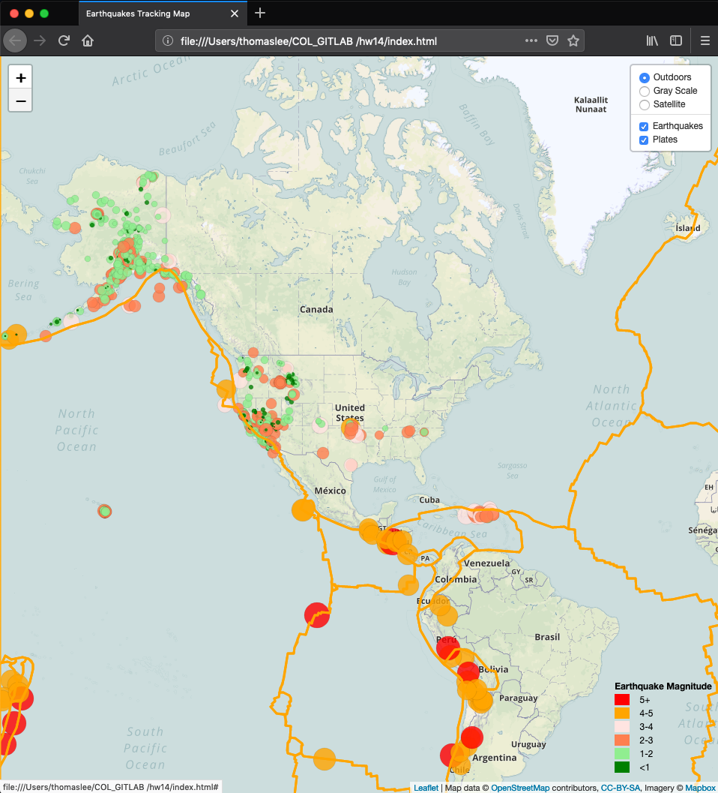

## Visualizing-Data-with-Leaflet

### Summary 
The assignment was accomplished using an earthquake data set for the last 7 days picked at [USGS GeoJSON Feed](http://earthquake.usgs.gov/earthquakes/feed/v1.0/geojson.php) page. The choosen data set was in a JSON format and the URL of the data set was used to pull the data and visualized on a map. A second layer of data was added to the map in order to llustrate the relationship between tectonic plates and seismic activity. The second data set containing tectonic plates was retrived visiting [Github](https://github.com/fraxen/tectonicplates.) page. The map created was built using Leaflet.

### Step 1: Basic Visualization 
Create a map using Leaflet that plots all of the earthquakes from your data set based on their longitude and latitude.

* Your data markers should reflect the magnitude of the earthquake in their size and color. Earthquakes with higher magnitudes should appear larger and darker in color.
* Include popups that provide additional information about the earthquake when a marker is clicked.
* Create a legend that will provide context for your map data.

### Step 2: Adding a layer with a second dataset 
Plot a second data set on your map to illustrate the relationship between tectonic plates and seismic activity. 

* Plot a second data set on our map.
* Add a number of base maps to choose from as well as separate out our two different data sets into overlays that can be turned on and off independently.
* Add layer controls to our map.

### Final Map Outcome

## Copyright

© 2019 realGenius, Inc.

